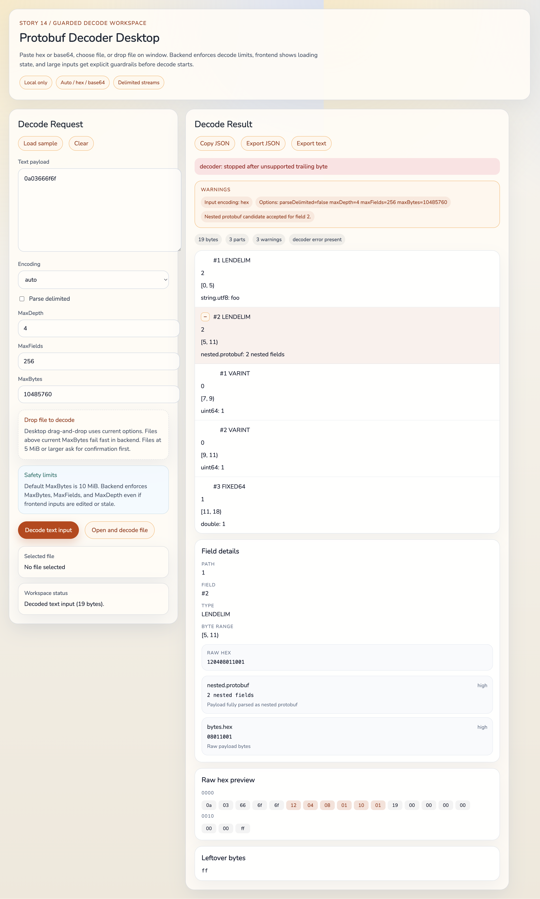

# Protobuf Decoder Desktop

Schema-less Protobuf wire inspector built with Go, Wails, React, and TypeScript.

Application stays local-only: pasted payloads, dropped files, selected files, decode heuristics, and exports all run on machine. No decode-related network upload path exists in app.

## What it does

- Decode unknown Protobuf payloads without `.proto` schema.
- Accept `auto`, `hex`, `base64`, and local binary file input.
- Detect and skip valid gRPC 5-byte message headers.
- Optionally parse varint length-delimited message streams.
- Show field tree, byte ranges, raw hex, nested candidates, warnings, leftover bytes, and decoder errors.
- Copy or export result as pretty JSON or text report.

## What it does not do

- No `.proto` import.
- No schema-aware field names, message names, enum names, oneof, map, or default-value recovery.
- Candidate values are heuristics, not guaranteed business truth.
- No cloud sync, remote parsing, or upload.

## Screenshot

Result workspace example:



## Quick start

Prerequisites:

- Go 1.21+
- Node.js 20+
- Wails CLI v2

Install dependencies:

```sh
npm --prefix frontend install
```

Check local environment:

```sh
wails doctor
```

Run desktop app in development mode:

```sh
wails dev
```

Build production desktop artifact for current OS:

```sh
wails build
```

Run project tests:

```sh
go test ./...
npm --prefix frontend test
```

## Input formats

Supported input sources:

- Text payload pasted into UI.
- Native file picker.
- Desktop drag-and-drop file decode.

Supported text encodings:

- `auto`: choose hex or base64 by heuristic, return warning when ambiguous.
- `hex`: ignores whitespace and common separators such as `,`, `:`, `-`, `_`, and `0x` prefixes.
- `base64`: accepts standard and raw/url variants when valid.

## Decode limits

Backend-enforced defaults:

- `MaxDepth = 4`
- `MaxFields = 256`
- `MaxBytes = 10 MiB`

Frontend can suggest safer values and warn before large file decode, but backend remains source of truth.

When limits hit:

- `MaxBytes`: decoder fails fast and reports size-limit error.
- `MaxFields`: decoder stops when the global decoded-field budget is exhausted across top-level, nested, and delimited messages, then returns leftover.
- `MaxDepth`: nested decode stops, parent field remains available with bytes and other candidates.

## Candidate interpretation guide

This tool is wire-level inspector. One field may have many plausible views.

- `VARINT`: unsigned, signed, ZigZag, bool/enum hint.
- `FIXED32`: `uint32`, `int32`, `float32`.
- `FIXED64`: `uint64`, `int64`, `double`.
- `LENDELIM`: UTF-8 string candidate, raw bytes candidate, optional nested protobuf candidate.

Important reading rule:

- Candidate shown first is strongest heuristic, not schema truth.
- Nested protobuf candidate only accepted when payload parses fully without leftover.
- `leftover` and warnings matter. They often explain why nested guess was rejected or decode stopped.

## Example payloads

Simple UTF-8 string field:

```text
0a03666f6f
```

Expected high-level result:

- Field `#1`
- Wire type `2`
- Type `LENDELIM`
- Candidate `string.utf8 = foo`
- Candidate `bytes.hex = 666f6f`

Delimited stream example:

```text
020801021002
```

Expected high-level result:

- One `MessageDelimiter` part per message.
- Per-message child fields rendered with global byte ranges.

gRPC header example:

```text
00000000020801
```

Expected high-level result:

- `GRPC_HEADER` part shown first.
- Body field parsed after byte offset `5`.

## Install notes

Platform-specific install and runtime notes live in [docs/platform-install.md](docs/platform-install.md).

## Troubleshooting

User-facing troubleshooting guide lives in [docs/troubleshooting.md](docs/troubleshooting.md).

## Release notes

Release note template lives in [.github/release-template.md](.github/release-template.md).

CI/release runner notes live in [.github/platform-release-notes.md](.github/platform-release-notes.md).

## Privacy

- Decode runs locally in Go backend.
- File content stays on machine.
- Clipboard/export writes only user-selected result content.
- No telemetry or remote decode service is implemented in app.

## Current release scope

Implemented stories cover decoder core, nested parsing, gRPC header handling, delimited streams, result inspection UI, exports, runtime guardrails, and GitHub Actions smoke builds.
